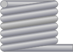

#  WireWrap
## A simple two-way json binding engine

This project aims to provide a simple two json binding engine that:
- uses similar syntax to knockout.js
- doesn't require observables but infers them
- use the actual HTML as templates
- is small
- doesn't use jQuery
